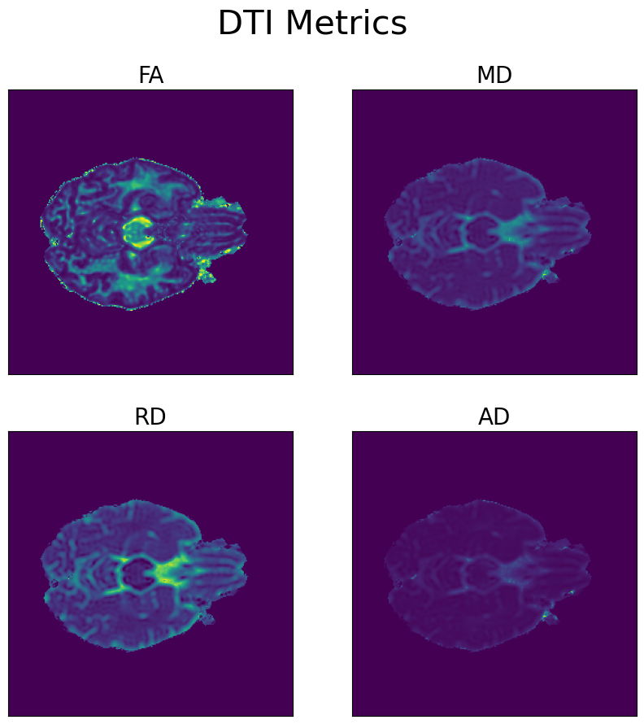

# DTI Processing Pipeline

This repository contains a concise Python-based DTI (Diffusion Tensor Imaging) processing pipeline that includes DICOMS to NIfTI conversion, skull stripping, eddy correction using FSL, fits a tensor model, and generates Fractional Anisotropy (FA), Mean Diffusivity (MD), Radial Diffusivity (RD), and Axial Diffusivity (AD) maps.

This DTI processing pipeline aims to provide a simple and accessible solution for researchers, clinicians, and students working with Diffusion Tensor Imaging data. The pipeline is designed with user-friendliness in mind, enabling users to process their DTI data with minimal setup and prior knowledge of the field.

The script consolidates several essential processing steps into a single, easy-to-use pipeline. This allows users to focus on their research objectives without getting bogged down in the complexities of multiple tools and manual processing steps. Moreover, the pipeline integrates well-known tools, such as dcm2niix and FSL, ensuring the quality and reliability of the processing.

By offering a streamlined and accessible approach to DTI data processing, this script empowers users to explore and analyze their data efficiently, ultimately contributing to advancements in research and clinical applications related to Diffusion Tensor Imaging.

## Dependencies

- Python 3
- Dipy
- NiBabel
- Nipype
- FSL
- Matplotlib

## Usage

1. Clone this repository and navigate to the project folder.

2. Install the required dependencies.

3. Update the `path`, `input_dir`, `output_dir`, `bval_file`, `bvec_file`, and `TotalReadoutTime` variables in the `if __name__ == "__main__":` block of the `dti_processing.py` script to match your local setup.

4. Run the `dti_processing.py` script:

```bash
python dti_processing.py <path> <input_dir> <output_dir> <bval_file> <bvec_file> <TotalReadoutTime>
```

The script will generate DTI maps (FA, MD, RD, and AD) and save them as NIfTI files in the specified output directory. It will also display a 2x2 plot of the generated maps.

Example output showing FA, MD, RD, and AD maps:



License
[MIT License]

Author
[Mason Kadem; mkadem@uwo.ca/kademm@mcmaster.ca]

Feel free to contact me for help :)
